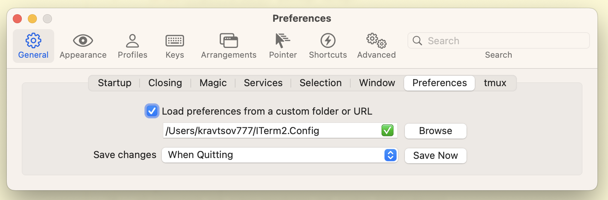

# Configuring just installed MacOS

## Install tools
- [brew](https://brew.sh) package manager
- [Karabiner](https://karabiner-elements.pqrs.org) keys remapper
- [ITerm2](https://iterm2.com) terminal
- [zsh](https://github.com/ohmyzsh/ohmyzsh/wiki/Installing-ZSH#macos) shell
- [oh-my-zsh](https://ohmyz.sh/#install) zsh package manager
- [fzf](https://github.com/junegunn/fzf#using-git) convinient recent files search
- [zsh-direnv](https://github.com/ptavares/zsh-direnv) direnv for zsh (install direnv from brew manually)
- [lf](https://github.com/gokcehan/lf) light console file manager

## Configure `Karabiner`
Create config folder
```bash
mkdir -p ~/.confing/karabiner
```

Download `karabiner.json` into folder
```bash
curl -o ~/.config/karabiner/karabiner.json https://raw.githubusercontent.com/sabahtalateh/init-system/main/karabiner.json
```

## Configure `ITerm2`
Create config folder
```bash
mkdir ~/ITerm2.Config
```

Download `com.googlecode.iterm2.plist` into folder
```
curl -o ~/ITerm2.Config/com.googlecode.iterm2.plist https://raw.githubusercontent.com/sabahtalateh/init-system/main/com.googlecode.iterm2.plist
```

Set folder as config folder (Preferences -> General -> Preferences)


## Configure `shell`
At `~/.zshrc` file add following line

```
# zsh config
export ZSH="$HOME/.oh-my-zsh"
ZSH_THEME="robbyrussell"
plugins=(git zsh-autosuggestions zsh-syntax-highlighting zsh-direnv) 
source $ZSH/oh-my-zsh.sh

# prompt
export PS1="%{%}%c%{%} $(git_prompt_info)"

# fzf
[ -f ~/.fzf.zsh ] && source ~/.fzf.zsh # fzf will popup by <ctrl+r>

# integrations when zsh is runnning as VS Code terminal
[[ "$TERM_PROGRAM" == "vscode" ]] && . "$(code --locate-shell-integration-path zsh)"

# vscode config
alias codeconf='code -n ~/Library/Application\ Support/Code/User/'

# lf
alias lf=lfcd
lfcd() {
    cd "$(command lf -print-last-dir "$@")"
}
```

## Configure `lf`

Create config dir

```bash
mkdir -p ~/.config/lf
```

At `~/.config/lf/lfrc` put

```
set hidden false

map <enter> open
map <backspace2> updir
```

## Next
- [VS Code](https://github.com/sabahtalateh/vscode-settings)

## Tips
### `XCode` previews not works after cleaning `~/Library/Developer`
Run 
```
sudo xcode-select -s /Applications/Xcode.app
xcrun simctl --set previews delete all
```
